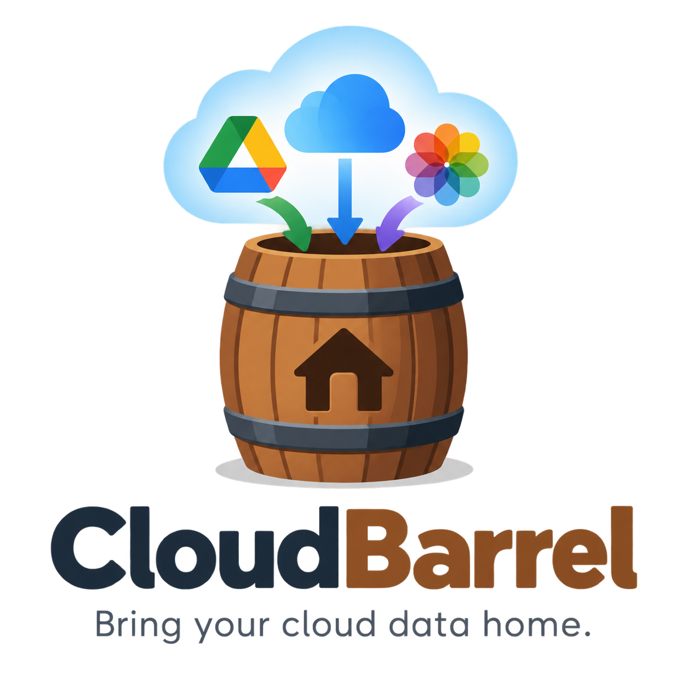

<p align="center">
  
</p>

# CloudBarrel

**Bring your cloud data home.**

CloudBarrel is a planned open-source, self-hosted backup tool for keeping independent, versioned local copies of data from consumer cloud services. It targets ordinary Linux machines and home servers, with optional integrations for OpenMediaVault, CasaOS, and constrained routers.

CloudBarrel is currently a documentation-first project. There is no installable release yet.

## Why it exists

Cloud storage is not a backup. Accounts get locked, sync bugs overwrite files, support does not reply — and one copy, held by someone else, is all that stands between you and losing years of photos. Exporting by hand does not solve it: 700 GB of iCloud Photos is days of supervised downloads, so it never happens.

CloudBarrel is set up once, copies data to storage the user controls, and proves the copy can be restored.

The reference setup covers Google Drive, iCloud Drive, and iCloud Photos. It uses proven transfer tools such as `rclone` rather than implementing another sync engine.

## Project shape

```text
Consumer clouds
      │
      ▼
CloudBarrel core
  jobs, runs, history, retention,
  integrity, restore checks, alerts
      │
      ▼
Local disk or NAS storage

Host integrations: plain Linux · OpenMediaVault · CasaOS · router-lite
```

The core stays independent of any NAS dashboard. Platform integrations expose the same backup behavior through the host's normal controls. This repository contains all of CloudBarrel and is complete on its own.

## Status

The working reference implementation runs on an ASUS ZenWiFi XT9 with Entware, shell scripts, `rclone`, cron, Healthchecks.io, and an ext4 USB disk. It proved the backup semantics and exposed the limits of running heavy backup work on a router.

Next milestone: migrate the proven workflow to plain Debian or Raspberry Pi OS with native `systemd` supervision. Implementation code follows after that.

## Documentation

- [Chat context](CHAT-CONTEXT.md) — self-contained project handoff for a new AI or human collaborator
- [Domain language](CONTEXT.md) — canonical project terms
- [Requirements](docs/requirements.md) — scope and acceptance conditions
- [Architecture](docs/architecture.md) — core and integration seams
- [Reliability](docs/reliability.md) — failure model and safeguards
- [Backup and restore](docs/backup-and-restore.md) — data semantics and recovery expectations
- [Photos Browse view](docs/photos-browse.md) — combined date-based access to Personal and Shared photos
- [Current XT9 setup](docs/current-xt9-setup.md) — evidence from the working prototype
- [Migration to Raspberry Pi](docs/migration-to-pi.md) — safe transition plan
- [Roadmap](ROADMAP.md) — ordered milestones and stop conditions
- [Architecture decision](docs/adr/0001-portable-core.md) — why the core stays independent of host platforms
- [Boundary decision](docs/adr/0002-independently-usable.md) — why CloudBarrel remains complete without external applications

## Platforms

| Platform | Intended support |
|---|---|
| [Debian, Ubuntu, Raspberry Pi OS](docs/platforms/plain-linux.md) | Reference deployment |
| [OpenMediaVault](docs/platforms/openmediavault.md) | Native NAS integration after the core is stable |
| [CasaOS and generic Docker](docs/platforms/casaos.md) | Accessible application packaging |
| [ASUSWRT, OpenWrt, and similar routers](docs/platforms/router.md) | Best-effort constrained deployment |

Media-server functions such as SMB, Transmission, DLNA, and Jellyfin belong to the host platform, not the backup core.

## Security

Never commit an `rclone.conf`, cloud session, Healthchecks URL, device export, or production state file. Local device snapshots belong under `references/private/`, which Git ignores.

## License

[Mozilla Public License 2.0](LICENSE).
